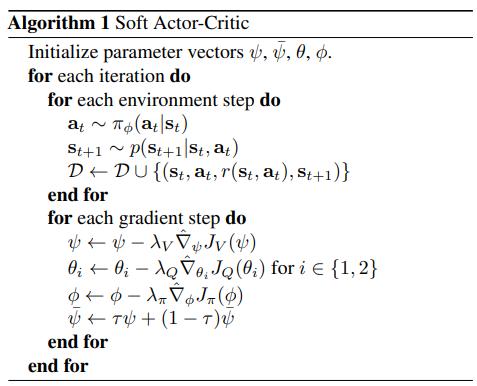
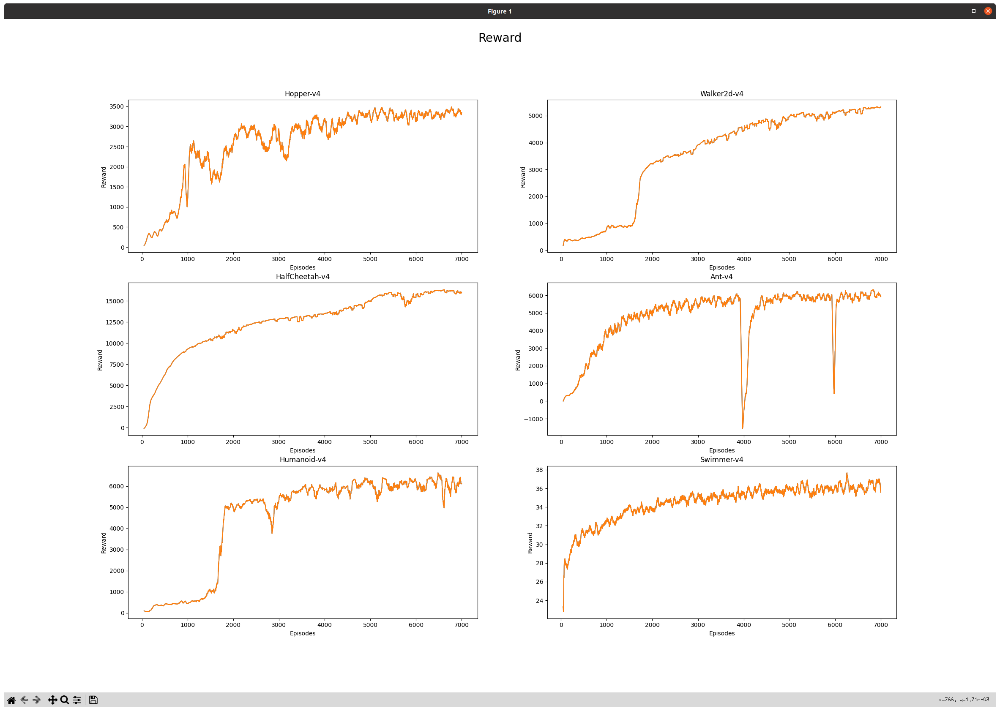

# Soft-Actor-Critic

## Papers
Soft Actor-Critic: Off-Policy Maximum Entropy Deep Reinforcement Learning with a Stochastic Actor :
https://arxiv.org/abs/1801.01290

## Algorithms

## results

Hopper-v4|Walker2d-v4|HalfCheetah-v4
:-----------------------:|:-----------------------:|:-----------------------:|
||

Ant-v4|Humanoid-v4|Swimmer-v4
:-----------------------:|:-----------------------:|:-----------------------:|
||

## Dependencies
- python == 3.10.0
- numpy == 1.23.5
- torch == 1.13.1
- gymnasium == 0.26.3
- mujoco-py == 2.2.0
## How to Run

### arguments

if you want see args,

    python3 train.py -h

### training
    python3 train.py

### evaluation

    python3 eval.py

## Acknowledgement
All credits goes to @pranz24 for his brilliant Pytorch implementation of SAC.
